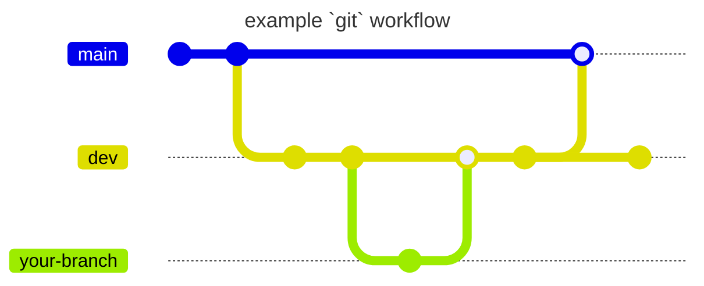

---
last_update:
    author: Carlos Valdez
    date: 0
description: Read up on the Ojos Project policies for git and GitLab!
---

# git Policies

[`git`](https://git-scm.org/) is a fantastic tool that helps developers manage
their source code. [GitLab](https://about.gitlab.com/) is a tool that helps
developers manage their many git repositories.

This document will outline how we will use `git` in the Ojos Project.

## `git`

### Branching

Here's a short table explaining how we will use `git` branching:

| Branch           | Description                                                                                     | Will be merged into |
| ---------------- | ----------------------------------------------------------------------------------------------- | ------------------- |
| `main`           | This is the branch that should always be stable.                                                | None                |
| `dev`            | This is the branch that Ojos developers add their changes to and test. **Main working branch.** | `main`              |
| Any other branch | A feature branch. If you can't push into `dev` or are using a forked branch, use this.          | `dev`               |

<!-- ? This uses Mermaid syntax. Learn more here: -->
<!-- ? https://mermaid.js.org/syntax/gitgraph -->



### Identity

Before committing, you should make sure your identity has been set. Please use
your name and email associated with the Ojos Project. Often, this is the email
associated with your educational institution. If I wanted to set my identity, I
would use:

```shell
git config --global user.name "Carlos Valdez"
git config -global user.email "cvaldezh@uci.edu"
```

### `git` Credit

Sometimes, you will need to commit for other individuals. There's two ways of
doing that.

You can add them as co-authors by having your commit message be:

```shell
your original message


Co-authored-by: Carlos Valdez <cvaldezh@uci.edu>
```

Another method is by changing the author for one commit by using this command:

```shell
git commit --author="Carlos Valdez <cvaldezh@uci.edu>"
```

## GitLab

### Issues & Merge Requests

Both Issues and Merge Requests are features that help us stay organized in
GitLab. However, something to keep in mind about these is that they are used to
reference one another. Issues can very likely be referenced back in the future,
so please behave appropriately in them.

### Issues via Email

People can open issues on GitLab using email. Each project has its own unique
email, so we cannot list them all here.

### Closing an Issue

To close an issue, please make sure you write something like "Fixed in
`commit hash`". That way, we can reference individuals to where the fix was made
so that, if in the future we need to reference it, we can.

### Push Limits

Pushing into the `main` branch will almost always be strictly forbidden unless
you were given permission to do so. In fact, GitLab won't allow you to push into
`main`. In order to get your changes in `main`, you must push/merge into `dev`.
We will open raise a Merge Request from `dev` to `main`.

### GitHub Backup

Although we primarily use GitLab,
[it has a reputation for destroying data](https://www.youtube.com/watch?v=tLdRBsuvVKc).
Therefore, we will be using the Mirroring Repositories feature to create a
GitHub mirror for backup purposes.

### Pipelines

When you push to any branch that is not `main`, you must ensure the
`.gitlab-ci.yml` pipeline must succeed. Usually, it contains tests that ensure
the `main` branch won't break, such as bundling or actual testing. If the repo
has a `.gitlab-ci.yml` file, please take a look at it to see what it will be
testing.

### Checklist for new repos

When creating a new repository, this must be done on GitLab:

| Rule                                               | Location                                                |
| -------------------------------------------------- | ------------------------------------------------------- |
| Ensure branch protection for `main` (push limits)  | `/-/settings/repository` under "Protected Branches"     |
| Ensure GitHub backup                               | `/-/settings/repository` under "Mirroring Repositories" |
| Disable "Enable 'Delete source branch' by default" | `/-/settings/merge_requests` under "Merge options"      |
| Enable "Pipelines must succeed"                    | `/-/settings/merge_requests` under "Merge checks"       |
